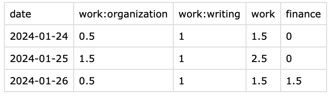

# Obsidian plugin for satisfying my needs of time tracking

## How to use

Create project .md file:

Add frontmatter required properties
```
---
reportKey: finance
doneToday: 0
pageType: project
---
```

`doneToday` - shows how much "something" you've done today. In my case it's amount of "pomodoros" I've finished for today. 
In settings page you can choose how many hours per tomato will be reported. By default - 0.5.

If you want to track separately project and subproject - instead of `doneToday` you should use `${subproject_name}_sub_done_today`.
You can have as many subprojects as you want.

!!! You should use only `doneToday` **OR** `${subproject_name}_sub_done_today`.
If you have both plugin will think that it should report only `doneToday`

Few examples of frontmatter configurations:

##### Just a project
```
---
reportKey: finance
doneToday: 2
pageType: project
---
```

##### With subprojects
```
---
reportKey: work
writing_sub_done_today: 2
organization_sub_done_today: 3
---
```


### Report example
- If you use `doneToday` only - it will be reported under the report key.
- If you have subprojects - they will be reported separately but under report key total amount will be reported. It allows you to change subprojects any time.



### How to report

Plugin adds two buttons:


- In the bottom - it adds new record into the csv file.
- On the top - it cleans up project files(doneToday or ${sub_project}_sub_done_today will become 0)

### Where is the data
The data is stored in the root vault folder.
Name: `time_statistics_report.csv`